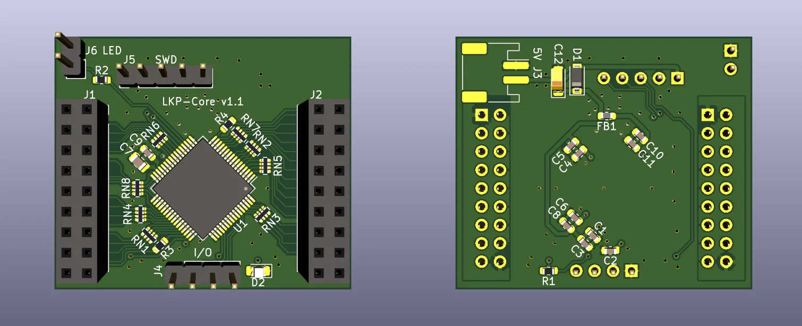

# LKP

レンくんピアノ (Len-kun Piano)

Capacitive touch slider controller for rhythm games.

# Contents

## pcb/LKP-Core

Microcontroller board for use with LKP electrode boards. Supports up to 32 channel of self capacitance input. Includes a WS281x LED driver channel with protection resistor. Supports I2C or UART as communication methods.

## pcb/LKP-Diva-Electrode-Tile

Electrode board for Project DIVA Future Tone slider controller. Works as a 2-tile setup. Both tiles use the same design, with right tile being a 180 degree rotated version of the left tile.

Requires KiCad version 6 (nightly) (supports `kicad_pcb format >= 20190605`) for hatched fills.

## pcb/LKP-Chu-Electrode-Tile

Electrode board for Chunithm slider controller. Works the same as its LKP-Diva counterpart.

Requires KiCad version 6 (nightly) (supports `kicad_pcb format >= 20190605`) for hatched fills.

# BOM

## LKP-Core

- **C1, C4, C6, C10**: Generic 1uF 0603 X5R ceramic capacitor. (I used `CC0603KRX5R8BB105`)
- **C2, C3, C5, C8, C11**: Generic 100nF 0603 ceramic capacitor. (I used `CL10B104KA8NNNC`)
- **C7**: `GRM2195C1H103JA01D`
- **C9**: `GCM1885C1H222JA16D`
- **C12**: Generic 10uF EIA-3216-18 tantalum capacitor.
- **D1**: Generic SOD-123 Schottky diode (`MBR0520L`).
- **D2**: Generic 0805 LED (yellow color).
- **FB1**: Generic 0603 ferrite bead (330ohm@100MHz).
- **J1, J2**: Straight female .1" header 2x9.
- **J3**: JST PH 2 positions.
- **J4**: **Angled** male .1" header 1x4.
- **J5**: **Angled** male .1" header 1x5.
- **J6**: **Angled** male .1" header 1x2.
- **R1**: Generic 1kohm 5% 0603 resistor.
- **R2**: Generic 470ohm 5% 0603 resistor.
- **R3, R4**: Generic 560ohm 5% 0603 resistor.
- **RN\***: Generic 560ohm 5% 0402x4 convex resistor array (I used `4D02WGJ0561TCE`).
- **U1**: `CY8C4246AZI-M445` (or `CY8C4247AZI-M485`, Needs minor firmware modifications)

## LKP-Diva-Electrode-Tile and LKP-Chu-Electrode-Tile

- **J1**: Straight male .1" SMD header 2x9 (**without** the notches on the bottom).

# Known issues / Erratas

- (LKP-Core v1.0) The reverse voltage protection diode (D1) does not protect C12. Proceed with caution when connecting the power to make sure the polarity is correct.
- (LKP-Core v1.1) When used with LKP-Assy, connector J4, J5 and J6 may collide with the bottom of LKP-Assy. A workaround would be soldering all the specified connectors on the back side of the PCB instead.
