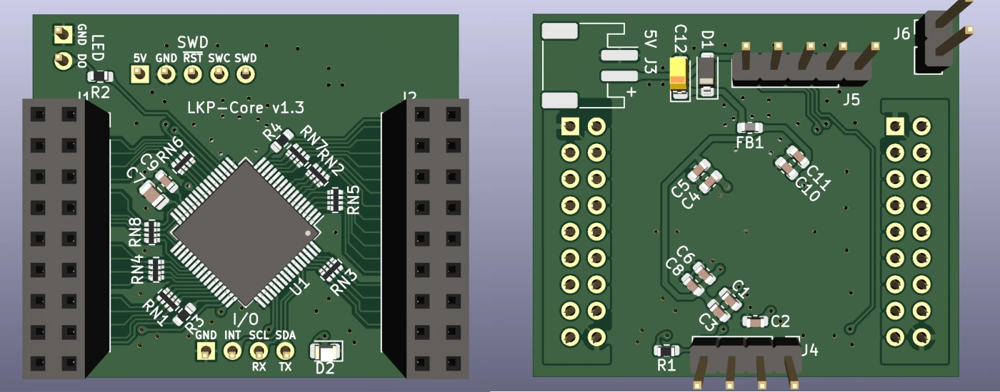

# LKP

レンくんピアノ (Len-kun Piano)

Capacitive touch slider controller for rhythm games.

# Contents

## pcb/LKP-Core

Microcontroller board for use with LKP electrode boards. Supports up to 32 channel of self capacitance input. Includes a WS281x LED driver channel with protection resistor. Supports I2C or UART as communication methods.

For sample firmware for use with LKP-Core, see [LKP-FW](https://github.com/Project-Alpaca/LKP-FW).

### Pin mapping

I/O port:

| \#  | Description |
| --- | ----------- |
|  1  | GND |
|  2  | INT |
|  3  | SCL/RX |
|  4  | SDA/TX |

WS281x LED connector:

| \#  | Description |
| --- | ----------- |
|  1  | GND |
|  2  | LED |

SWD connector:

| \#  | Description |
| --- | ----------- |
|  1  | VTARG |
|  2  | GND |
|  3  | RESET |
|  4  | SWCLK |
|  5  | SWDIO |

## pcb/LKP-Diva-Electrode-Tile

Electrode board for Project DIVA Future Tone slider controller. Works as a 2-tile setup. Both tiles use the same design, with right tile being a 180 degree rotated version of the left tile.

Requires KiCad version 5.99 (nightly) (supports `kicad_pcb format >= 20210228`) for hatched fills.

## pcb/LKP-Chu-Electrode-Tile

Electrode board for Chunithm slider controller. Works the same as its LKP-Diva counterpart.

Requires KiCad version 5.99 (nightly) (supports `kicad_pcb format >= 20210228`) for hatched fills.

## pcb/LKP-IF-Qwiic

SparkFun [Qwiic®][qwiic]/Adafruit [STEMMA® QT][stemmaqt] interface for LKP-Core. Converts between 5V logic used by LKP-Core and 3.3V logic used by Qwiic®/STEMMA® QT.

It is also possible to use it to convert UART signal for main microcontroller running between 1.65V and 3.6V. To set it up:

1. Break out the signals on any Qwiic® connector using a Qwiic® breakout board.
2. Connect the 3.3V pin to microcontroller's I/O voltage reference (must be between 1.65V and 3.6V).
3. Connect SDA (blue wire, UART TX) to RX and SCL (yellow wire, UART RX) to TX.
4. The other Qwiic® port should be left unconnected.

Note that although the low side of the level shifter can take any voltage between 1.65V and 3.6V, 3.3V must be used in order to maintain compatibility with other Qwiic®-compatible systems.

# BOM

## LKP-Core

- **C1, C4, C6, C10**: Generic 1uF 0603 X5R ceramic capacitor. (I used `CC0603KRX5R8BB105`)
- **C2, C3, C5, C8, C11**: Generic 100nF 0603 ceramic capacitor. (I used `CL10B104KA8NNNC`)
- **C7**: `GRM2195C1H103JA01D`.
- **C9**: `GCM1885C1H222JA16D`.
- **C12**: Generic 10uF EIA-3216-18 tantalum capacitor.
- **D1**: Generic SOD-123 Schottky diode (`MBR0520L`).
- **D2**: Generic 0805 LED (yellow color).
- **FB1**: Generic 0603 ferrite bead (330ohm@100MHz).
- **J1, J2**: Straight female .1" header 2x9.
- **J3**: JST PH 2 positions.
- **J4**: Straight male .1" header 1x4 (can be angled if not using `LKP-IF-*`).
- **J5**: Straight male .1" header 1x5 (can be angled if not using `LKP-IF-*`).
- **J6**: **Angled** male .1" header 1x2.
- **R1**: Generic 1kohm 5% 0603 resistor.
- **R2**: Generic 470ohm 5% 0603 resistor.
- **R3, R4**: Generic 560ohm 5% 0603 resistor.
- **RN\***: Generic 560ohm 5% 0402x4 convex resistor array (I used `4D02WGJ0561TCE`).
- **U1**: `CY8C4246AZI-M445` (or `CY8C4247AZI-M485`, Needs minor firmware modifications).

## LKP-Diva-Electrode-Tile and LKP-Chu-Electrode-Tile

- **J1**: Straight male .1" SMD header 2x9 (**without** bumps at the bottom).
  - This can be hard to find. For small scale DIY manufacturing try searching "pin header double smd" on aliexpress.

## LKP-IF-Qwiic

- **C1, C2**: Generic 100nF 0603 ceramic capacitor. (I used `CL10B104KA8NNNC`).
- **D1**: Generic SOD-123 Schottky diode (`MBR0520L`).
- **J1, J2**: JST SH SM04B.
- **J3**: Straight female (10.5mm stacking or regular) .1" header 1x5.
- **J4**: Straight female (10.5mm stacking or regular) .1" header 1x4.
- **J5**: Straight or angled male .1" header header 1x2 (Optional if using stacking headers for J3-4).
- **U1**: `TCA9406DCTR`.

# Powering

By default LKP expects 5V power. Using lower supply voltage down to 1.8V is possible by modifying the power specs in LKP-FW and adding a level shifter module to the WS281x driver pin (labeled as LED on board). Reference voltage for I/O can be approximated by tapping into the VTARG pin on the SWD port.

# Known issues / Erratas

- (LKP-Core v1.0) The reverse voltage protection diode (D1) does not protect C12. Proceed with caution when connecting the power to make sure the polarity is correct.
- (LKP-Core v1.1) When used with LKP-Assy, connector J4, J5 and J6 may collide with the bottom of LKP-Assy. A workaround would be soldering all the specified connectors on the back side of the PCB instead. Also, when using LKP-IF-Qwiic, J4 and J5 must be soldered on the back side.

[qwiic]: https://www.sparkfun.com/qwiic
[stemmaqt]: https://learn.adafruit.com/introducing-adafruit-stemma-qt/what-is-stemma-qt
